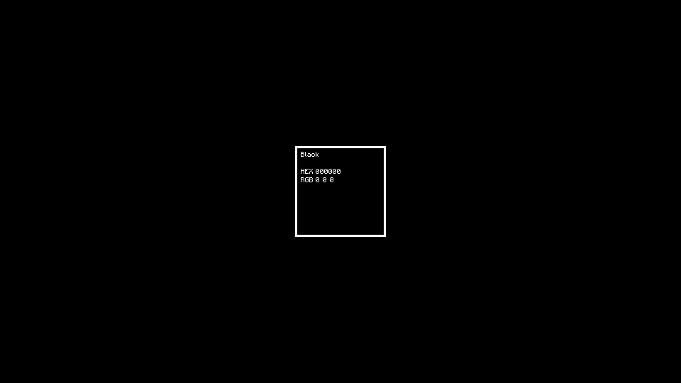

# ColorWallpaper

A Minimalist wallpaper generator

Generates wallpapers such as:

## Usage
- `-o`/`--output` `PATH`
  - Used to specify image output path. Defaults to `out.png`.
- `-c`/`--color` `COLOR`
  - Used to specify Background color. Defaults to `Hot Pink`.
- `-c2`/`--color2` `COLOR`
  - Used to specify text color. Defaults to inverse of `-color`.
- `-d`/`--display` `NAME`
  - Overrides the display name of the `-color`. Empty string disables the name row.
- `-r`/`--resolution` `RESOLUTION`
  - Used to specify image resolution. Defaults to `1920x1080`.
- `-s`/`--scale` `SCALE`
  - The size of the highlight will be divided by this. Defaults to `3`.
- `-f`/`--formats` `FORMAT` [`FORMAT` ...]
  - Declares the order and formats to display
- `-l`/`--lowercase`
  - Controls the casing of hex output
- `-y`/`--yes`
  - Forces overwrite of `--output`
  
#### Argument formats
- `COLOR`
  - `#Hex`: Three or six hexadecimal digits optionally starting with `#`.
  - `R,G,B`: Three comma separated numbers in range 0-255.
  - `random`: Literal string. Will pick a random color with a name.
  - Valid name of a color.
- `RESOLUTION`
  - Two positive integers greater or equal to 150, separated by `x` or `:`.
- `FORMAT`
  - Self explanatory: `hex`, `rgb`, `hsv`, `hsl`, `cmyk` 
  - `empty`: Empty row.
  - `#hex`: Six hexadecimal digits.
  
