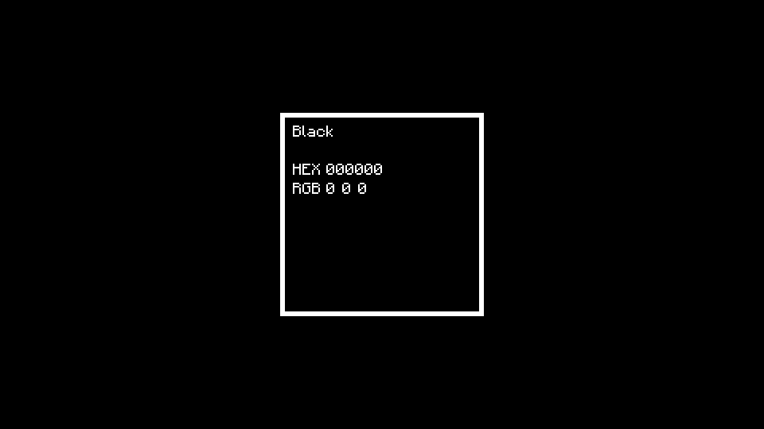

# ColorWallpaper


[](https://codecov.io/gh/BranislavBajuzik/ColorWallpaper)
[](https://github.com/psf/black)
[](https://badge.fury.io/py/color-wallpaper)

A Minimalist wallpaper generator

### [**Get the latest release**](https://github.com/BranislavBajuzik/ColorWallpaper/releases/latest "Download")

Generates wallpapers such as:


## Requirements
- [Python 3.6+](https://www.python.org/downloads/ "Download Python")
- [PIL](https://pypi.org/project/Pillow/ "Download PIL")

## Usage
Direct generation: `python ColorWallpaper.py --option[s]`

### Options:
- `-h`/`--help`
  - Display help and exit

#### File options
- `-o`/`--output` `PATH`
  - Used to specify image output path.
  - Default: `out.png`
- `-y`/`--yes`
  - Forces overwrite of `--output`

#### Color options
- `-c`/`--color` `COLOR`
  - Used to specify Background color. Also accepts `random` which picks random named color.
  - Default: `random`
- `-c2`/`--color2` `COLOR`
  - Used to specify text color. Also accepts `inverted` which is the inverse of `--color`.
  - Default: `inverted`
- `-d`/`--display` `NAME`
  - Overrides the display name of the `--color`. Empty string disables the name row.
- `--min-contrast` `CONTRAST`
  - Min contrast of `--color` and `--color2`, if `--color2` is `inverted`. Will raise if this can not be satisfied.
  - Default: `1`
- `--overlay-color` `COLOR`
  - Used to specify color of potential overlay, like icons or text.
- `--overlay-contrast` `CONTRAST`
  - Min contrast of --color and --overlay-color. Will raise if this can not be satisfied.
  - Default: `1`

#### Display options
- `-r`/`--resolution` `RESOLUTION`
  - Used to specify image resolution.
  - Default: `1920x1080`.
- `-s`/`--scale` `SCALE`
  - The size of the highlight (128px) will be multiplied by this.
  - Default: `3`
- `-f`/`--formats` [`FORMAT` ...]
  - Declares the order and formats to display
  - Default: `empty HEX rgb`

#### Argument formats
- `COLOR`
  - `#Hex`: Three or six hexadecimal digits optionally starting with `#`.
  - `R,G,B`: Three comma separated numbers in range 0-255.
  - Valid name of a color.
- `CONTRAST`
  - A float in range 1-21.
- `RESOLUTION`
  - Two positive integers greater or equal to 150, separated by `x` or `:`.
- `FORMAT`
  - Self explanatory: `hex`, `rgb`, `hsv`, `hsl`, `cmyk`
  - `empty`: Empty row.
  - `#hex`: `hex`, but starting with `#`
  - `#HEX`, `HEX`: Like `hex`, but uppercase

## Examples

#### The [above image](example.png)
`python -m color_wallpaper --color black --output example.png --formats empty HEX rgb --resolution 960x540 --scale 2`

#### Dynamic Android wallpaper
Changes the wallpaper to a new color every time the screen is turned on. Tested on OnePlus 6T.

Install [Tasker](https://play.google.com/store/apps/details?id=net.dinglisch.android.taskerm), [Termux](https://play.google.com/store/apps/details?id=com.termux), and [Termux:Tasker](https://play.google.com/store/apps/details?id=com.termux.tasker)

In Termux run:
```Shell
# Give Termux access to internal storage
termux-setup-storage

# Get Python
pkg upgrade
pkg install python python-dev libjpeg-turbo git

# Get Python libraries
pip install --upgrade pip
pip install --upgrade setuptools
LIBRARY_PATH="/system/lib" CPATH="$PREFIX/include" pip install pillow

# Pull the project
git clone https://github.com/BranislavBajuzik/ColorWallpaper.git

# Setup triggers for Termux:Tasker
mkdir -p ~/.termux/tasker/
echo $'cd ~/ColorWallpaper\npython -m color_wallpaper -y -o /sdcard/Pictures/Excluded/paper.png -c random --min-contrast 2.5 --overlay-color white --overlay-contrast 1.5 -r 1080x2340 -s 4 -f empty \#HEX rgb hsv cmyk' > ~/.termux/tasker/generate-wallpaper.sh
chmod u+x ~/.termux/tasker/generate-wallpaper.sh

# Setup the output folder
mkdir -p /sdcard/Pictures/Excluded
touch /sdcard/Pictures/Excluded/.nomedia
```

In Tasker:
- Create a new Task
  - Add Termux Action with Configuration set to `generate-wallpaper.sh`
  - Add Set Wallpaper Action with Image set to `Pictures/Excluded/paper.png`
- Create a new Event Profile for Display Off event, give it Highest priority, and set it's Task to the one you just created.

Edit `~/.termux/tasker/generate-wallpaper.sh` to change arguments (e.g. your screen resolution) of the program.

Run `cd ~/ColorWallpaper && git pull` to update the program.

## Contribute

#### Setup environment
```Shell
python -m pip install -r requirements.txt
python -m pip install -r requirements-dev.txt
pre-commit install
```

#### Run tests
```Shell
python -m unittest discover
```
